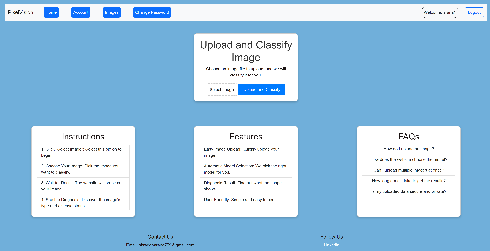

# PixelVision
The PixelVision project is a user-friendly medical image classification web application that leverages the capabilities of Django, a high-level Python web framework, a containerization platform, to perform image recognition/classification tasks. The project aims to provide an accessible platform for users to upload images and receive real-time recognition results.

# Running the project
Create an environment, install dependencies, and run the server.
1. python3 -m venv env
2. source env/bin/activate
3. pip install -r requirements.txt
4. cd pixelvision
5. python3 manage.py runserver

# Setting up the Models
The project requires pre-trained machine learning models stored in a `models.zip` file. Follow these steps to set them up:
1. Download `models.zip` (if not already available in the repository).
2. Extract the contents of `models.zip`.
3. Move the extracted `models` folder into the `pixelvision/` directory.

```sh
unzip models.zip
mv models pixelvision/
```

Now your project is ready to use with the required models.


